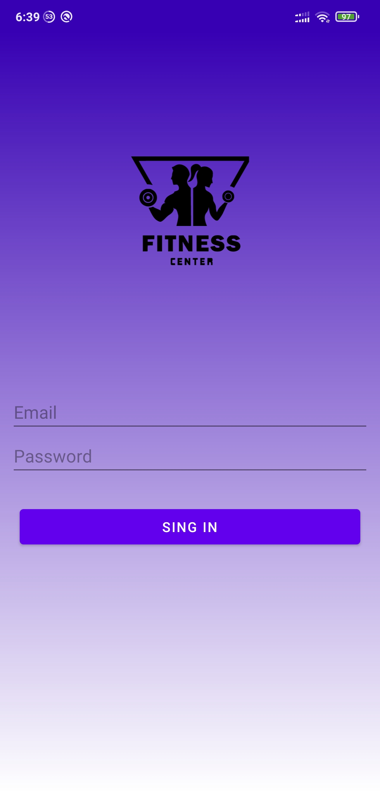
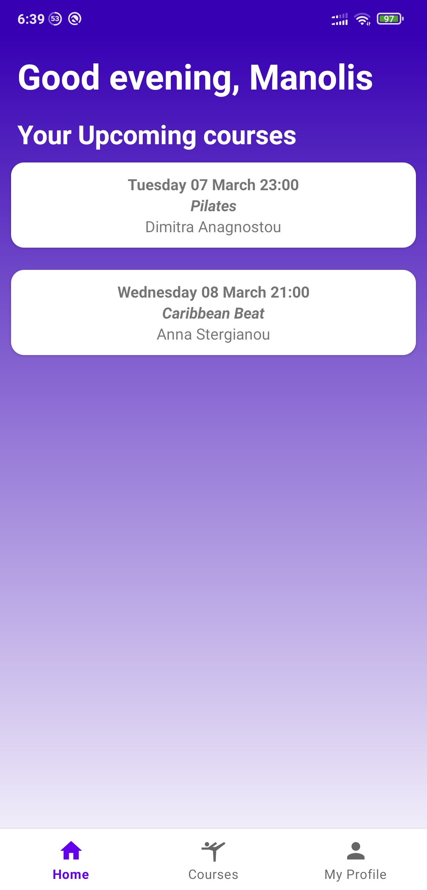
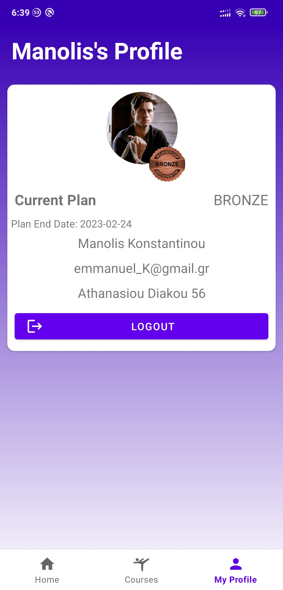
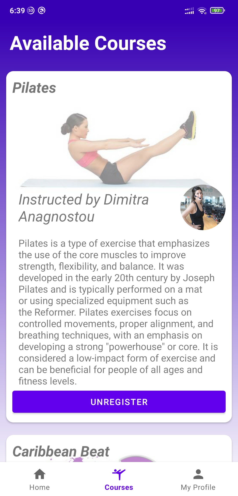
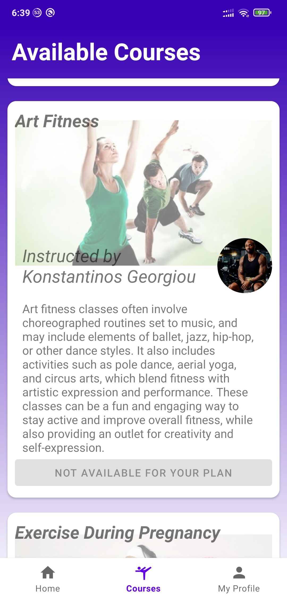

# React Promotional Website For Gym

## **The website requires the API to be running in order to work. Please refer to the [API](../../Backend/README.md) for more information.**

This is a promotional website for a gym. It is built with React and uses Bootstrap UI for the design.

# Built with

* [React](https://reactjs.org/)
* [Bootstrap](https://getbootstrap.com/)
* [JavaScript](https://www.javascript.com/)
* [CSS](https://developer.mozilla.org/en-US/docs/Web/CSS)
* [AXIOS](https://www.npmjs.com/package/axios)
* [NPM](https://www.npmjs.com/)

## Libraries Used
- react-router-dom - To handle routing
- axios - To handle api requests
- react - To construct the webpage
- react-bootstrap - To make the webpage look good

## Features
- Simple and standardized UI
  -Built using Bootstrap 
- User login & authentication
  - Send user credentials to the server and get a token
- Inclusive and full potential functionalities

<!-- TODO: how to build/run the website-->

### `npm install`

### `npm start`

Runs the app in the development mode.\
Open [http://localhost:3000](http://localhost:3000) to view it in your browser.

The page will reload when you make changes.\
You may also see any lint errors in the console.

# Screenshots

<table>
  <tr>
    <td></td>
    <td></td>
    <td></td>
  </tr>
    <td></td>
    <td></td>
  <tr></tr>
</table>
